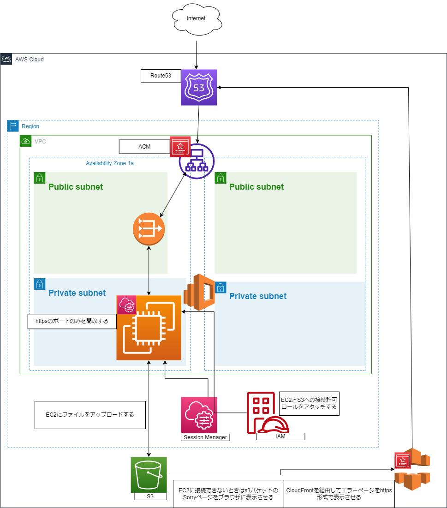

# ALBでのEC2インスタンスの冗長化に当たり詰まったところ

## 本記事の作成理由
高いセキュリティと冗長性を持つ構成を実験的に作成したい。
纏まった休みができたので、試験のための学習以外にもSAAのための学習の一環として手を動かしたい。
作業中に詰まったところを共有したい。

## 要件
1. 2つのAZを使用する
2. EC2インスタンスへのインターネットからの直接接続は拒否する
3. EC2インスタンスはインターネットからはhttpsによる通信のみを受け付ける
4. ウェブブラウザに表示される内容は通信がALBによってどのEC2インスタンスに振り分けられても同じ内容でなければならない(ただし、ホスト名に関しては区別がつくようにしたい)
5. EC2インスタンスに置くファイル、フォルダはS3バケットからダウンロードする
6. S3へのインターネットからの接続は拒否する(ただしS3バケット内の障害発生時のエラー画面はインターネットから接続できるようにする)

以下が構成図です。この構成を作成するにあたり詰まったところを共有していきます。


## 詰まったところ
1. まず冗長化の為に必要なことが何なのかという事から考え始めました。
AZが複数必要なことは分かったのですが、EC2をインターネットから直接接続できないようにすることを考えると
一体どうやって自分自身がEC2に接続したらよいのかと悩み始め、
セッションマネージャーでの接続を考えました。
これでポート22を開けることと鍵の管理の必要が無くなるので、セキュリティ面にも良いと考えています。

2. 次にプライベートサブネットの中のEC2がどうやってクライアントにデータを渡すのかがわかりませんでした。
分かったこととしてNATゲートウェイが各AZに必要であるという事やNATがVPC内部からインターネットに出るための専用の通路のようなものという事がありました。

3. 次にALBの設定を考えましたが、EC2に割り当てられるセキュリティグループの設定に問題があり、それがなかなか解決できませんでした。
httpとhttpsのためのポートを開けていなかったことに気づき、ポートを解放しました。
この時点では気づかなかったのですが、他にも名前解決のためにTCPとUDPポートとEC2間でのファイル共有のためにNFSのポートを開けておく必要がありました。

4. ドメインをお名前ドットコムで取得し、AWSでゾーンの作成後にお名前ドットコムのネームサーバーをAWSのネームサーバーに書き換えました。
これに関しては特につまりはしませんでしたが、ACMによる証明書発行の際のdns検証でこの作業をしていないとおそらく検証に失敗すると思います。
詰まったところはこの時点ではエラーページをhttps形式で表示させるためにap-northeast-1の証明書1つとN.Virginiaの証明書1つが必要だったのですが、
それに気づかなかったところです。
というのもS3はhttpsでのウェブサイトホスティングに対応していないようで、
https化のためにCloudFrontというサービスを経由する必要があります。それにはN.VirginiaのACMで発行された証明書が必要でした。
これも後から気づきましたが、N.Virginiaで発行された証明書の他にap-northeast-1の証明書が必要なのはap-northeast-1のALBに証明書を割り当てるためです。

5. 証明書の割り当てには問題無く成功しましたが、今度はDNSの設定で詰まりました。
3でも書きましたが、dnsのためのTCPとUDPポートの2つを割り当てる必要がありました。
またEC2停止時にS3バケットのエラーページを表示させるためにフェイルオーバールーティングが必要なことにこの時点で初めて気づきました。


更にEC2停止の際にそれが検知されるために以下のようにヘルスチェックを設定する必要があります。


6. 冗長化構成を作成しようとしているので、EC2内で保持されているウェブページは同期されていなければなりません。
同期作業の前に今回は実験のため以下のように記述されたindex.phpを作成しました。
```
<!DOCTYPE html>
<html lang="en">
<head>
  <meta charset="UTF-8">
  <meta name="viewport" content="width=device-width, initial-scale=1.0">
  <title>Note</title>
</head>
<body>
  <h1><?php echo "hostname is:".gethostname (); ?></h1>
</body>
</html>
```
これでファイルの記載内容を同じ状態にしつつ、それぞれのEC2のホスト名を表示させるようにできます。

7. EFSの実装でもセキュリティグループで詰まりました。
適切なセキュリティグループをEFSに割り当てていなかったためにEFSをEC2にマウントできませんでした。
ここでもNFSを許可するセキュリティグループの割り当てが必要でした。

8. 後から気づきましたが、EFSをEC2にマウントしてもEC2が再起動されるとEFSがアンマウントされます。
それは不都合なので、EC2へのEFSの自動マウントを有効化する必要があります。
以下のサイトを参考にして作業しました。


9. 全ての設定完了後に冗長化が機能していることとエラーページ表示確認とEC2再起動後に本来のページが表示されることを確認するところで詰まりました。
EC2が起動していることをAWSコンソール画面で確認し、Route 53で設定したドメインがhttps形式で表示され、
何度かページを更新するとホスト名が変わることまでは問題なく確認できました。
次に全てのEC2を停止させ、エラーページが表示されることを確認しようとしましたが、
EC2停止後すぐにはエラーページは表示されませんでした。
どうもヘルスチェック機能がEC2が停止していることを認識するために数分かかるようです。
しばらく待った後でページを更新するとエラーページがhttps形式で表示されることを確認できました。
今度はEC2を起動させ、しばらく待ってからページを更新するとEC2のホスト名が表示されず、
先ほどと同様のエラーページが表示されたままとなっていました。
原因はブラウザのキャッシュを削除していなかったことでした。
キャッシュ削除後にホスト名が正常に表示され、
何度かページを更新するとホスト名が変わったため、冗長化されていることも確認できました。

## まとめ
一連の作業の多くの所で詰まったので、実際には各AWSサービスの関連性やセキュリティ面を理解していなかったことが分かりました。
実際に手を動かしたのはとても良い経験になったと思います。