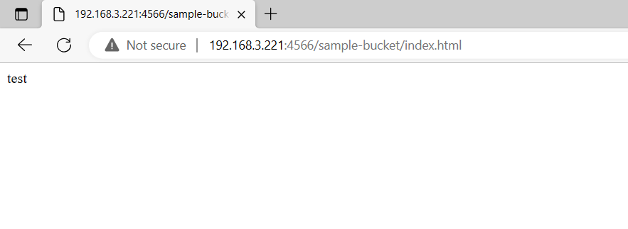

# LocalStackを使い、ローカル環境にs3バケットを作成し、ウェブブラウザでs3バケットのファイルを閲覧する

## 背景

> 無料でAWSの動作検証がローカル環境でできるLocalStackというサービスがあると聞いて、試しに使ってみようと思った。
> 全てのサービスを利用する場合は、課金が必要です。

## 内容

> AlmaLinux9で作業をして、そこでs3バケットを作成し、別のPCからウェブブラウザでs3バケットを閲覧します。

## 必要なもの

- AWS CLI か awslocal CLI
- Docker
- Python (pip installを使用するから)
- Apacheなどのhttpサーバー機能を利用できるようにするもの
- LocalStack

## AWS CLIをインストールする

- curl "https://awscli.amazonaws.com/awscli-exe-linux-x86_64.zip" -o "awscliv2.zip"
- unzip awscliv2.zip
- sudo ./aws/install

## Dockerをインストールする

- sudo yum install docker-ce docker-ce-cli containerd.io docker-buildx-plugin docker-compose-plugin

## pythonをインストールする

- dnf install -y python36

## Apacheをインストールする(別のPCからウェブブラウザでs3バケットを閲覧するから)

- yum install httpd
- systemctl start httpd.service
- systemctl enable httpd.service

> firewallを使用している場合はhttpポートを開放する必要があります。
> そうしないと別のPCからウェブブラウザでs3バケットを閲覧できません。
> httpポートを開放するために以下のコマンドを実行する。

- firewall-cmd --permanent --zone=public --add-service=http
- firewall-cmd --reload

## LocalStackをインストールする

- python3 -m pip install --upgrade localstack

## ウェブブラウザで閲覧するためのhtmlファイルを /var/www/html に作成する

- htmlファイルの中身は何でもよいので、いったんtestとだけ記載されたhtmlファイルを作成する。

- cd /var/www/html
- echo test >> index.html

- 一般的にはhtmlファイルを作成するときはVisual Studio Codeなどを使うことが多いと思うので、PC上で作成したファイルをサーバーに転送したいと思うかもしれません。
- その場合は /var/www/html の所有者をよく確認する必要があります。
- 例えば、 /var/www/html の所有者が root でサーバーに別のユーザーとして接続している場合は権限不足のためファイルをサーバーに転送することはできません。
- その場合は root ユーザーとしてサーバーにログインするか、 /var/www/html の所有者を別のユーザーに変更する必要があります。

## s3バケットを作成する

> この後は下記参考文献に従いました。

- https://qiita.com/y-u-t-a/items/712e98e2298bdbe1a66c

> 上の記事の中の「S3 バケット内のオブジェクト一覧取得」まで終わったら以下の形式のURLをウェブブラウザの検索欄に入力してs3バケットの中身を閲覧できるかどうか確認します。

- http://<サーバーのIPアドレス>:<ポート番号>/<s3バケット名>/index.html

> うまくいくと下のような感じでhtmlファイルを閲覧できるはずです。

## まとめ

> 無課金か月額固定でAWS環境をローカル環境で検証できるサービスがあることを知って、試しに無料で使えるs3の機能を確認してみました。
> うまくいったので、ほかの機能も試してみようと思います。

### 参考文献
- https://docs.aws.amazon.com/ja_jp/cli/latest/userguide/getting-started-install.html
- https://docs.docker.com/engine/install/centos/
- https://qiita.com/y-u-t-a/items/712e98e2298bdbe1a66c
- https://docs.localstack.cloud/getting-started/installation/