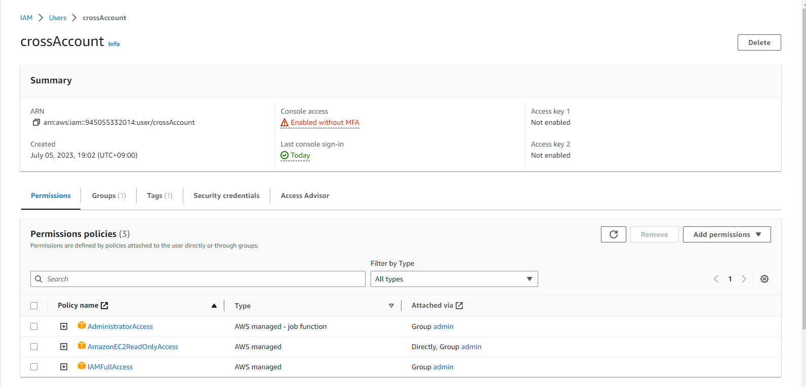

```
$ aws ec2 describe-instances --profile dev-session
{
    "Reservations": [
        {
            "Groups": [],
            "Instances": [
                {
                    "AmiLaunchIndex": 0,
                    "ImageId": "ami-05ffd9ad4ddd0d6e2",
                    "InstanceId": "i-047e577182590e87f",
                    "InstanceType": "t2.micro",
                    "KeyName": "presentation",
                    "LaunchTime": "2023-07-05T12:56:15+00:00",
                    "Monitoring": {
                        "State": "disabled"
                    },
                    "Placement": {
                        "AvailabilityZone": "ap-northeast-1c",
                        "GroupName": "",
                        "Tenancy": "default"
                    },
                    "PrivateDnsName": "ip-172-31-12-183.ap-northeast-1.compute.internal",
                    "PrivateIpAddress": "172.31.12.183",
                    "ProductCodes": [],
                    "PublicDnsName": "ec2-18-179-207-188.ap-northeast-1.compute.amazonaws.com",
                    "PublicIpAddress": "18.179.207.188",
                    "State": {
                        "Code": 16,
                        "Name": "running"
                    },
                    "StateTransitionReason": "",
                    "SubnetId": "subnet-09cace3efb27df3db",
                    "VpcId": "vpc-00f292e14d98dc55a",
                    "Architecture": "x86_64",
                    "BlockDeviceMappings": [
                        {
                            "DeviceName": "/dev/xvda",
                            "Ebs": {
                                "AttachTime": "2023-07-05T12:56:16+00:00",
                                "DeleteOnTermination": true,
                                "Status": "attached",
                                "VolumeId": "vol-024a9443d73fdc3da"
                            }
                        }
                    ],
                    "ClientToken": "d9c25517-b4a1-47ba-bed1-aefdd3e5fd9c",
                    "EbsOptimized": false,
                    "EnaSupport": true,
                    "Hypervisor": "xen",
                    "NetworkInterfaces": [
                        {
                            "Association": {
                                "IpOwnerId": "amazon",
                                "PublicDnsName": "ec2-18-179-207-188.ap-northeast-1.compute.amazonaws.com",
                                "PublicIp": "18.179.207.188"
                            },
                            "Attachment": {
                                "AttachTime": "2023-07-05T12:56:15+00:00",
                                "AttachmentId": "eni-attach-05b06d487c13534ad",
                                "DeleteOnTermination": true,
                                "DeviceIndex": 0,
                                "Status": "attached",
                                "NetworkCardIndex": 0
                            },
                            "Description": "",
                            "Groups": [
                                {
                                    "GroupName": "launch-wizard-2",
                                    "GroupId": "sg-0a12ab0262a7d2bd8"
                                }
                            ],
                            "Ipv6Addresses": [],
                            "MacAddress": "0a:34:8f:08:0f:07",
                            "NetworkInterfaceId": "eni-0323d6e9d606f8974",
                            "OwnerId": "945055332014",
                            "PrivateDnsName": "ip-172-31-12-183.ap-northeast-1.compute.internal",
                            "PrivateIpAddress": "172.31.12.183",
                            "PrivateIpAddresses": [
                                {
                                    "Association": {
                                        "IpOwnerId": "amazon",
                                        "PublicDnsName": "ec2-18-179-207-188.ap-northeast-1.compute.amazonaws.com",
                                        "PublicIp": "18.179.207.188"
                                    },
                                    "Primary": true,
                                    "PrivateDnsName": "ip-172-31-12-183.ap-northeast-1.compute.internal",
                                    "PrivateIpAddress": "172.31.12.183"
                                }
                            ],
                            "SourceDestCheck": true,
                            "Status": "in-use",
                            "SubnetId": "subnet-09cace3efb27df3db",
                            "VpcId": "vpc-00f292e14d98dc55a",
                            "InterfaceType": "interface"
                        }
                    ],
                    "RootDeviceName": "/dev/xvda",
                    "RootDeviceType": "ebs",
                    "SecurityGroups": [
                        {
                            "GroupName": "launch-wizard-2",
                            "GroupId": "sg-0a12ab0262a7d2bd8"
                        }
                    ],
                    "SourceDestCheck": true,
                    "Tags": [
                        {
                            "Key": "Name",
                            "Value": "EC2"
                        }
                    ],
                    "VirtualizationType": "hvm",
                    "CpuOptions": {
                        "CoreCount": 1,
                        "ThreadsPerCore": 1
                    },
                    "CapacityReservationSpecification": {
                        "CapacityReservationPreference": "open"
                    },
                    "HibernationOptions": {
                        "Configured": false
                    },
                    "MetadataOptions": {
                        "State": "applied",
                        "HttpTokens": "optional",
                        "HttpPutResponseHopLimit": 1,
                        "HttpEndpoint": "enabled",
                        "HttpProtocolIpv6": "disabled",
                        "InstanceMetadataTags": "disabled"
                    },
                    "EnclaveOptions": {
                        "Enabled": false
                    },
                    "PlatformDetails": "Linux/UNIX",
                    "UsageOperation": "RunInstances",
                    "UsageOperationUpdateTime": "2023-07-05T12:56:15+00:00",
                    "PrivateDnsNameOptions": {
                        "HostnameType": "ip-name",
                        "EnableResourceNameDnsARecord": true,
                        "EnableResourceNameDnsAAAARecord": false
                    },
                    "MaintenanceOptions": {
                        "AutoRecovery": "default"
                    },
                    "CurrentInstanceBootMode": "legacy-bios"
                }
            ],
            "OwnerId": "945055332014",
            "ReservationId": "r-0aa8546b5c1cfa7cb"
        }
    ]
}
```