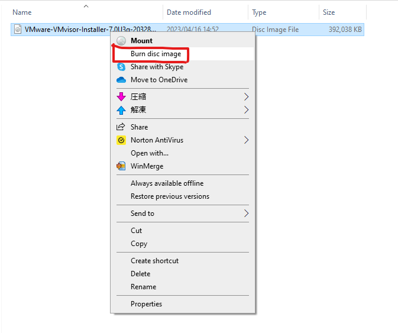

# 背景
> AWSのクラウド破産の話を何度か聞いたことがあり、どうにかして課金額を可能な限り下げ、クラウド破産の不安を払拭したうえで効果的にクラウドの学習ができないだろうかと考えたのがこの記事を作成した理由です。

# 作業内容
> 具体的な手法としては自宅に物理サーバーを設置し、それを仮想化することが簡単な方法だと思い、やってみました。
> 物理環境とクラウド環境には違いがありますが、それはある程度、AWSの使い方がわかれば環境の差分を埋めるのはそこまで難しくないと思います。
> どうしても実行しておきたいのはAWSのVPCとEC2環境の再現です。
> なぜかというとAWS学習時以外には使用しないEC2サーバーを停止し忘れたことで余計な課金が発生したという話を一番よく聞いたからです。
> どうしても必要というわけではありませんが、外部ネットワークと内部ネットワークを分けてネットワークを構築しておきたかったので、それも行います。
 AWSは従量課金制であることが利点ですが今回の場合は、あくまでも個人の学習用環境の構築が目的なので長期的な課金と比較すると確実に元が取れるはずです。

# 用意するもの(そこそこ初期費用がかかります。)
- OSがインストールされていないサーバー (私は中古サーバー(ProLiant ML30 Gen10)を購入したので、いろいろ欠落している部品がありました。例えば、ハードディスクをサーバーに挿入するためのハードディスクトレイやHDDなどはありませんでした。このサーバーの見た目はデスクトップです。)
- モニター
- ルーター (私の環境では既存のルーターは勝手にいじれないので、既存のルーターの配下に別のルーターを接続する必要がありました。)
- スイッチ (任天堂スイッチではありません。)

- ルーターとスイッチに接続するコンソールケーブル

- データ用DVD

- ESXiのisoファイル (無料でダウンロード可能です。)

- LANケーブル (必要な長さのものを購入してください。必要以上にケーブルが長いと邪魔になります。)
- TeraTerm (用意するものが必ずTeraTermである必要はありません。Puttyなどでもよいと思います。必須ではありませんが、自動でログが取られるように設定したほうがよいでしょう。)

> 中古サーバーでは以下のものが欠落している可能性があります。
- ハードディスク (お金に余裕があればSSDのほうが良いかもしれません。私は容量2TBのハードディスクを買いました。)
- メモリ (サーバーのメモリスロット数によりますが、例えば4スロットあれば16GBx4枚か32GBx4枚ぐらいあれば学習用としては十分だと思います。)
- ハードディスクトレイ
- OS (この記事ではOSの代わりにサーバーにVMware ESXiを入れます。VMwarePlayerは使いません。)

# 手順1 サーバーセットアップ
- データ用dvdにESXiのisoファイルを焼きこむ


- サーバーを起動後にESXiのisoファイルを焼きこんだdvdをサーバーに読み込ませる。
> 私が購入したサーバー(ProLiant ML30 Gen10)にはdvdドライブが搭載されていたので、それにdvdを入れました。

- BIOSを開く
> ProLiant ML30 Gen10はサーバー起動時に特に何かボタンを押さずともセットアップ画面のようなものが開くようです。
> F11でBIOSのブートメニューを開けました。

- BIOSにてdvdでサーバーを起動させる

- しばらくするとESXiのインストールウィザードがモニターに表示されるので、案内通りにインストールを進める。一方通行なので、迷うことはないと思います。

# 手順2 TeraTermで自動でログをとるように設定する。


# 手順3 ルーターを設定する
> 私はCisco ルーター 892Jを用意しました。メルカリで買いました。

- まず、このルーターを既存の家庭用ルーターの空いているポートにLANケーブルでつなぎます。

- WANリンクであるGigabitEthernetのインターネットと既存の家庭用ルーターを接続する

- ルーターにコンソールケーブルを挿入し、反対側のUSB端子をPCに接続する

- ルーターを起動する (私が購入したCisco ルータ 892Jには電源ボタンはなく、電源ケーブル挿入後にすぐ起動しました。)

- TeraTermを起動し、Serialを選択する。


- ルーターの起動が完了したら、任意のインターフェースをトランクモードに設定する。このインターフェースをスイッチに接続します。
```
User Access Verification

Password:
Router>en
Password:
Router#conf t
Enter configuration commands, one per line.  End with CNTL/Z.
Router(config)#int
Router(config)#interface fa
Router(config)#interface fastEthernet 0
Router(config-if)#sw
Router(config-if)#switchport mo
Router(config-if)#switchport mode tru
Router(config-if)#switchport mode trunk
```

- 家庭用ルーターに割り当てられているプライベートIPアドレスが何かを確認する。
> コマンドプロンプトを開き、コマンド*ipconfig*にてデフォルトゲートウェイとしてルーターに割り当てられているプライベートIPアドレスを確認する。
> 仮にこのプライベートIPアドレスが192.168.3.1 255.255.255.0だったという設定で話を進めます。
> webブラウザにてデフォルトゲートウェイとして家庭用ルーターに割り当てられているアドレスを検索欄に入力する。ほとんどの家庭用ルーターにはこの方法でアクセスできると思います。
> 既存の家庭用ルーターに割り当てられているプライベートIPアドレスが何かを確認するだけで、特に設定変更などは行いません。これを後の手順で192.168.3.0/25と192.168.3.128/25に分割します。


# 手順4 スイッチのセットアップ
> Catalyst 2960を例に出して、説明します。
- 手順3で家庭用ルーターに割り当てられているアドレスが192.168.3.1/24だと判明したので、このアドレスが属しているネットワーク192.168.3.0/24を192.168.3.0/25と192.168.3.128/25に分けます。
- vlan1が最初から存在しており、全てのfastEthernetのインターフェースがvlan1に割り当てられています。
- vlan1にネットワーク192.168.3.128/25の中からまだ使用されていない任意のプライベートIPアドレスを割り当てます。
- 任意のインターフェースをトランクに設定する。下の画像ではコンソールケーブルを使用したSerial接続ではなくTCP/IPによる接続ですがSerial接続で接続しても何の問題もありません。
- TCP/IPによる接続を実現するにはスイッチに管理用IPアドレスを割り当て、パスワードを設定する必要がありますが、それに関しては別の記事にまとめる予定です。
```
User Access Verification

Password:
Switch>en
Password:
Password:
Switch#conf t
Enter configuration commands, one per line.  End with CNTL/Z.
Switch(config)#int fa
Switch(config)#int fastEthernet 0/13
Switch(config-if)#swi
Switch(config-if)#switchport mode tru
Switch(config-if)#switchport mode trunk
```

# 手順5 Cisco ルーター 892Jにルート設定を行う
- 以下の画像のように192.168.3.0/25と192.168.3.128/25を設定する。
```
User Access Verification

Password:
Router>en
Password:
Router#conf t
Enter configuration commands, one per line.  End with CNTL/Z.
Router(config)#ip route 192.168.3.0 255.255.255.128 192.168.3.1
Router(config)#ip route 192.168.3.128 255.255.255.128 192.168.3.1
```

- 192.168.3.128/25のネットワークに属しているデバイスがインターネットにアクセスできるようにするためのルートも設定する
```
Router(config)#ip route 0.0.0.0 0.0.0.0 192.168.3.1
```

- ルーター上でトランクに設定したインターフェースとスイッチ上でトランクに設定したインターフェースをLANケーブルでつなぐ

- 192.168.3.128/25のデバイスのプライベートIPアドレスがISPから払いだされているパブリックIPアドレスと紐づけられるようにするためにNAPTを設定する。
```
interface GigabitEthernet0
 ip address 192.168.3.20 255.255.255.128
 ip nat outside
 ip virtual-reassembly in
 duplex auto
 speed auto
!
interface Vlan1
 ip address 192.168.3.129 255.255.255.128
 ip nat inside
 ip virtual-reassembly in
!
ip forward-protocol nd
!
!
no ip http server
no ip http secure-server
ip dns server
ip nat inside source list 1 interface GigabitEthernet0 overload
ip route 0.0.0.0 0.0.0.0 192.168.3.1
ip route 192.168.3.0 255.255.255.128 192.168.3.1
ip route 192.168.3.128 255.255.255.128 192.168.3.1
```

- 以上の手順で設定は完了です。では192.168.3.128/25のネットワークの中からまだ使用されていない任意のプライベートIPアドレスとスイッチのvlan1のプライベートIPアドレスをデフォルトゲートウェイとしてPCに設定し、念のためWi-Fiを無効化することで確実に有線の経路が使用されるようにして、コマンドプロンプトを開き、**tracert 192.168.3.1**にて通信経路を確認してみましょう。
```
C:\Users\PC_User>ipconfig

Windows IP Configuration


Ethernet adapter E1:

   Connection-specific DNS Suffix  . :
   IPv4 Address. . . . . . . . . . . : 192.168.3.140
   Subnet Mask . . . . . . . . . . . : 255.255.255.128
   Default Gateway . . . . . . . . . : 192.168.3.129

C:\Users\PC_User>tracert google.com

Tracing route to google.com [googleのアドレス]
over a maximum of 30 hops:

  1    <1 ms    <1 ms    <1 ms  Router [192.168.3.129]
  2     2 ms     1 ms     1 ms  192.168.3.1
  3    11 ms     6 ms     6 ms  何かのパブリックIPアドレス1
  4     7 ms     7 ms     6 ms  何かのパブリックIPアドレス2
  5     7 ms     7 ms     8 ms  何かのパブリックIPアドレス3
  6     8 ms     7 ms     8 ms  何かのパブリックIPアドレス4
  7     8 ms     7 ms     7 ms  何かのパブリックIPアドレス5
  8     8 ms     7 ms     8 ms  何かのパブリックIPアドレス6
  9    16 ms    15 ms    15 ms  何かのパブリックIPアドレス7
 10    22 ms    29 ms    25 ms  何かのパブリックIPアドレス8
 11    14 ms    14 ms    14 ms  何かのパブリックIPアドレス9
 12    15 ms    15 ms    15 ms  何かのパブリックIPアドレス10
 13    15 ms    14 ms    14 ms  googleのアドレス [googleのアドレス]

Trace complete.

C:\Users\PC_User>
```
- やや変則的な方法ではありますが、これで家庭用ルーターの配下にルーターを新規追加したため、192.168.3.128/25のネットワークがインターネットに抜けるには必ず192.168.3.0/25のネットワークを経由することになるとわかると思います。
- ルーターでルート設定をしたときに各ルートのネクストホップを家庭用ルーターのデフォルトゲートウェイ192.168.3.1に設定しました。
- これのこと
```
Router(config)#ip route 192.168.3.0 255.255.255.128 192.168.3.1
Router(config)#ip route 192.168.3.128 255.255.255.128 192.168.3.1
Router(config)#ip route 0.0.0.0 0.0.0.0 192.168.3.1
```

# 手順6
- 以上で実際のAWS VPCと比較すると小規模ではありますが、VPCの再現ができました。後はwebブラウザでESXiにログインして、仮想マシンを立ち上げます。
> 以降は今後、加筆する予定です。ここから先の手順ではインターフェースは異なりますが、AWSのEC2での作業と同様に仮想サーバーを立ち上げるだけです。
> ESXiのインターフェースの見た目は下の画像のようなものです。
